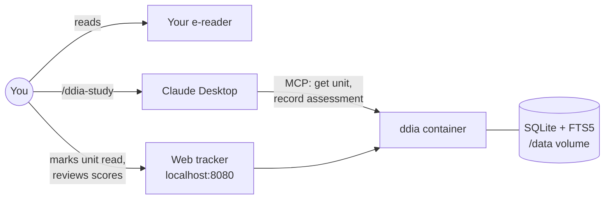

# ddia-assist

A small, locally hosted helper for working through *Designing Data-Intensive Applications*.
You read the book in your own e-reader. This service tracks what you've read and gives
Claude Desktop (over MCP) the exact text of each unit, so Claude can quiz you on it, set
short reasoning tasks, and write the results back here. The service makes no LLM calls
itself, so it costs nothing in tokens.

## This project is spec-driven

The spec in [`docs/spec/`](docs/spec/README.md) is the source of truth. Behaviour changes
start as spec changes, and code and tests point back to requirement IDs. See
[`docs/spec/README.md`](docs/spec/README.md) for how that works.

| Spec | Covers |
|---|---|
| [00 Overview](docs/spec/00-overview.md) | Goals, non-goals, architecture, glossary |
| [01 Ingest](docs/spec/01-ingest.md) | EPUB → sections → reading units |
| [02 Data model](docs/spec/02-data-model.md) | SQLite schema |
| [03 MCP interface](docs/spec/03-mcp.md) | Tools, prompts, the read-scope rule |
| [04 Study session](docs/spec/04-study-session.md) | Explain → Probe → Apply → Verdict, scoring, task shapes |
| [05 Review queue](docs/spec/05-review-queue.md) | Spaced review of weak concepts |
| [06 Web UI](docs/spec/06-web-ui.md) | Tracker pages |
| [07 Deployment](docs/spec/07-deployment.md) | Docker, Claude Desktop wiring |
| [08 Roadmap](docs/spec/08-roadmap.md) | Milestones and open questions |
