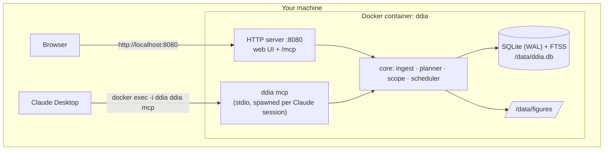

# 00 Overview

## Problem

DDIA is long and dense. Reading it passively gives a feeling of understanding that fades
quickly. What works is retrieval practice: explaining a part from memory, being questioned
on the gaps, applying the ideas to a small concrete problem, and coming back to weak spots
later. Doing that by hand with a chatbot is clumsy. You have to paste text, remember where
you were, and nothing is recorded.

## Goals

- Split the book into reading units of about 10–20 pages that each form a logically complete block.
- Track reading progress per unit.
- Let Claude Desktop run a structured study session on a unit, using the book's exact text,
  and write the results back.
- Record understanding per concept and bring weak concepts back for spaced review.
- Keep tasks scoped to what has already been read, and keep them short and focused on one
  piece of reasoning.
- Spend no tokens from the service. All LLM work happens in the user's own Claude client.

## Non-goals

- Showing the book itself. Reading happens in the user's own e-reader.
- An in-app chat, or any server-side LLM calls.
- PDF ingest (EPUB only for now), multiple users, authentication, or cloud hosting.

## Architecture

One Go binary has two entry points:

- `ddia serve` is the long-running process. It serves the web UI and an MCP endpoint over streamable HTTP at `/mcp`.
- `ddia mcp` speaks MCP over stdio. Claude Desktop starts it inside the running container
  with `docker exec`. It shares the core package and database with `serve`.

Both open the same SQLite file in WAL mode, which handles one writer and many readers fine
for a single user.

## Glossary

| Term | Meaning |
|---|---|
| Section | A node in the book's heading tree (chapter, h2, h3…), with a stable ID like `ch05.s03.s02`. |
| Unit | A run of consecutive sections inside one chapter, sized for one reading sitting. The unit of progress. |
| Read scope | All units marked read or studied. The only content MCP tools return. |
| Concept | A named idea from the book (e.g. "read repair"), tied to the unit that introduces it. |
| Session | One study or review conversation in Claude, recorded through MCP. |
| Score | A per-concept rating from 0 to 3: missing, shaky, solid, could teach it. |
