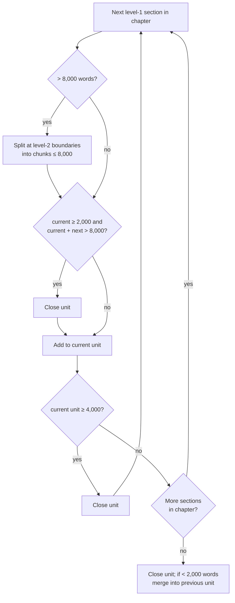

# 01 Ingest: EPUB → sections → units

## Parsing

- **ING-1** The service MUST accept an EPUB (2 or 3) uploaded through the web UI.
- **ING-2** Chapter order MUST come from the OPF spine, and titles from the nav document (EPUB 3) or NCX (EPUB 2).
- **ING-3** Each chapter's XHTML MUST be split into a section tree. For HTMLBook markup (O'Reilly), the tree
  comes from nested `<section data-type="sect1|sect2|…">` elements, each titled by its first heading; for other
  EPUBs it falls back to splitting on `h2`–`h4`. Text before the first subsection belongs to the parent section.
  Spine items that aren't chapters or appendices (cover, preface, index, glossary…) are skipped.
- **ING-4** Section bodies MUST be stored as Markdown. Paragraphs, lists, tables, code blocks,
  emphasis and inline code are kept. Index-term anchors and page markers are dropped.
- **ING-5** Images MUST be extracted to `/data/figures/` and referenced from the Markdown with their caption.
- **ING-6** End-of-chapter reference lists and footnote blocks MUST be stored but flagged
  `is_reference`. They are excluded from unit word counts, from FTS and from unit text by default.
- **ING-7** Section IDs MUST be deterministic for a given EPUB: `ch{NN}` for chapters, then `.s{NN}`
  per level in document order (`ch05.s02.s01`), and `ch{NN}.refs` for the reference block. Appendices use `app{A}`.
- **ING-8** Re-importing the same file (same SHA-256) MUST be a no-op. Importing a different
  file for the same book MUST keep progress and assessments for units whose section ranges still exist.

## Unit planning

A page is assumed to be about 400 words, so 10–20 pages is about 4,000–8,000 words.

- **ING-9** Units MUST only break at heading boundaries and MUST NOT cross chapters.
- **ING-10** The planner SHOULD aim for 4,000–8,000 words per unit, using the algorithm above.
  A chapter's intro text goes into its first unit.
- **ING-11** The user MUST be able to merge adjacent units and split a unit at any heading inside
  it, from the web UI. Manual edits are kept when the planner is re-run.
- **ING-12** Each unit gets a title. By default it's the first section's heading, or
  "A – B" when the unit spans several sections. The user can rename it.
