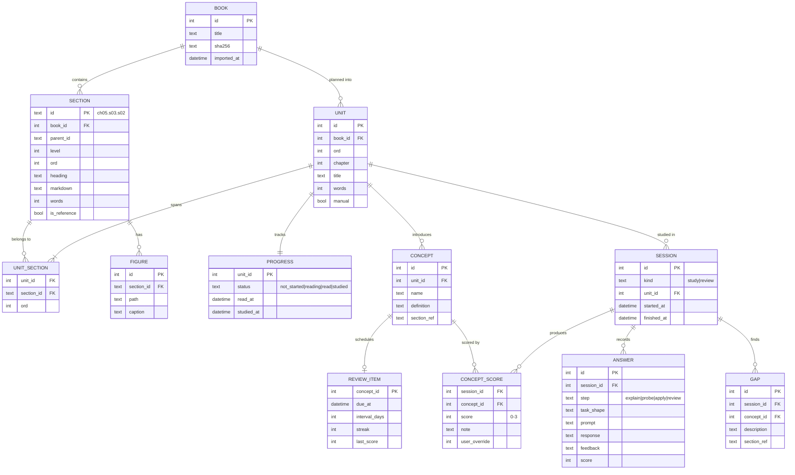

# 02 Data model

SQLite in WAL mode at `/data/ddia.db`. Migrations are embedded in the binary and run on start.

- **DAT-1** `section_fts` is an FTS5 table over `heading` and `markdown` for non-reference sections.
- **DAT-2** A concept's *current score* is its latest `CONCEPT_SCORE`, with `user_override`
  taking precedence over `score` when it is set.
- **DAT-3** Raw answers (`ANSWER.response`) MUST be stored verbatim. They're the evidence used to audit a score.
- **DAT-4** Deleting a book MUST cascade. No other deletes are exposed.
- **DAT-5** Units count as *in read scope* when their `PROGRESS.status` is `read` or `studied`.
