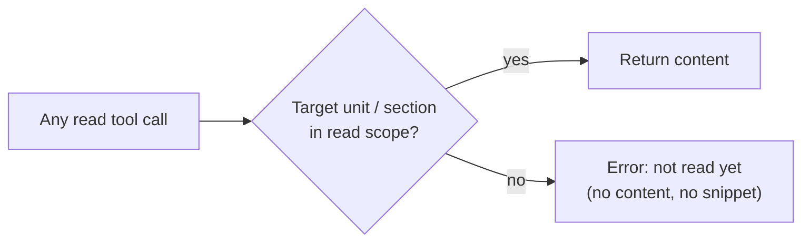

# 03 MCP interface

The MCP server is the only way an AI client sees the book or writes results. The same
handlers serve both transports: stdio (`ddia mcp`) and streamable HTTP (`/mcp`).

## The read-scope rule



- **MCP-1** Every tool that returns book text, concepts or search results MUST filter to
  the read scope (DAT-5). A chapter's reference block is in scope once any unit of that chapter is. This is what keeps tasks limited to what's been read: it's
  enforced in the server, not left to the prompt.
- **MCP-2** There are no exceptions, including for the unit about to be studied. If it isn't marked
  read yet, `get_unit` returns an error and Claude asks you to confirm you've read it. Only then does it call `mark_read`.

## Tools

| Tool | Input | Returns / effect |
|---|---|---|
| `get_status` | – | Current unit, units read/studied/total, number of due reviews, 5 weakest concepts |
| `get_unit` | `unit_id?` (defaults to the next unit that is read but not yet studied) | Unit title, section IDs and Markdown, figure captions, known concepts |
| `get_section` | `section_id` | One section's Markdown |
| `get_figure` | `figure_id` | The image as MCP image content |
| `search_book` | `query`, `limit≤10` | FTS snippets with section IDs, read scope only |
| `save_concepts` | `unit_id`, `[{name, definition, section_ref}]` | Stores the unit's 3–12 key concepts, each citing a section of that unit. Only allowed if the unit has none yet |
| `get_weak_concepts` | `limit` | Concepts in read scope with current score ≤ 1, weakest first |
| `record_assessment` | see below | Stores a study session, marks the unit `studied`, updates the review queue |
| `get_due_reviews` | `limit` | Due review items with concept, definition, last gap |
| `record_review` | `concept_id`, `prompt`, `response`, `score`, `feedback` | Stores a review answer and reschedules the item |
| `mark_read` | `unit_id` | Marks a unit read (same as the button in the UI) |

`record_assessment` input:

```json
{
  "unit_id": 12,
  "answers": [
    {"step": "explain", "prompt": "...", "response": "...", "feedback": "..."},
    {"step": "probe",   "prompt": "...", "response": "...", "feedback": "...", "score": 2},
    {"step": "apply",   "task_shape": "predict_outcome", "prompt": "...", "response": "...", "feedback": "...", "score": 1}
  ],
  "concept_scores": [{"concept_id": 41, "score": 1, "note": "confuses sloppy quorum with strict"}],
  "gaps": [{"concept_id": 41, "description": "...", "section_ref": "ch06.s04.s02"}]
}
```

- **MCP-3** `record_assessment` MUST reject: a score outside 0–3, a concept that doesn't belong to
  the unit or an earlier unit in read scope, a `section_ref` outside read scope, a missing `explain` answer, more than one `apply` answer, an `apply` without a known task shape, or a concept of the unit left unscored (SES-10).
  The error message says what to fix, so Claude can retry.
- **MCP-4** Each gap MUST cite a `section_ref`. This makes Claude ground every criticism in the book's text rather than its own memory of DDIA.
- **MCP-5** Writes are idempotent per call. Claude MAY pass a `client_session_id`, and a
  repeated call with the same ID returns the earlier result.

## Prompts

- **MCP-6** `ddia-study` (optional arg `unit_id`) expands to the study-session instructions in [04](04-study-session.md).
- **MCP-7** `ddia-review` (optional arg `limit`, default 5) expands to the review instructions in [05](05-review-queue.md).
- **MCP-8** Prompt texts live in `internal/mcpserver/prompts/*.md` and are embedded at build time. They are
  part of the spec: changing one is a spec change.
