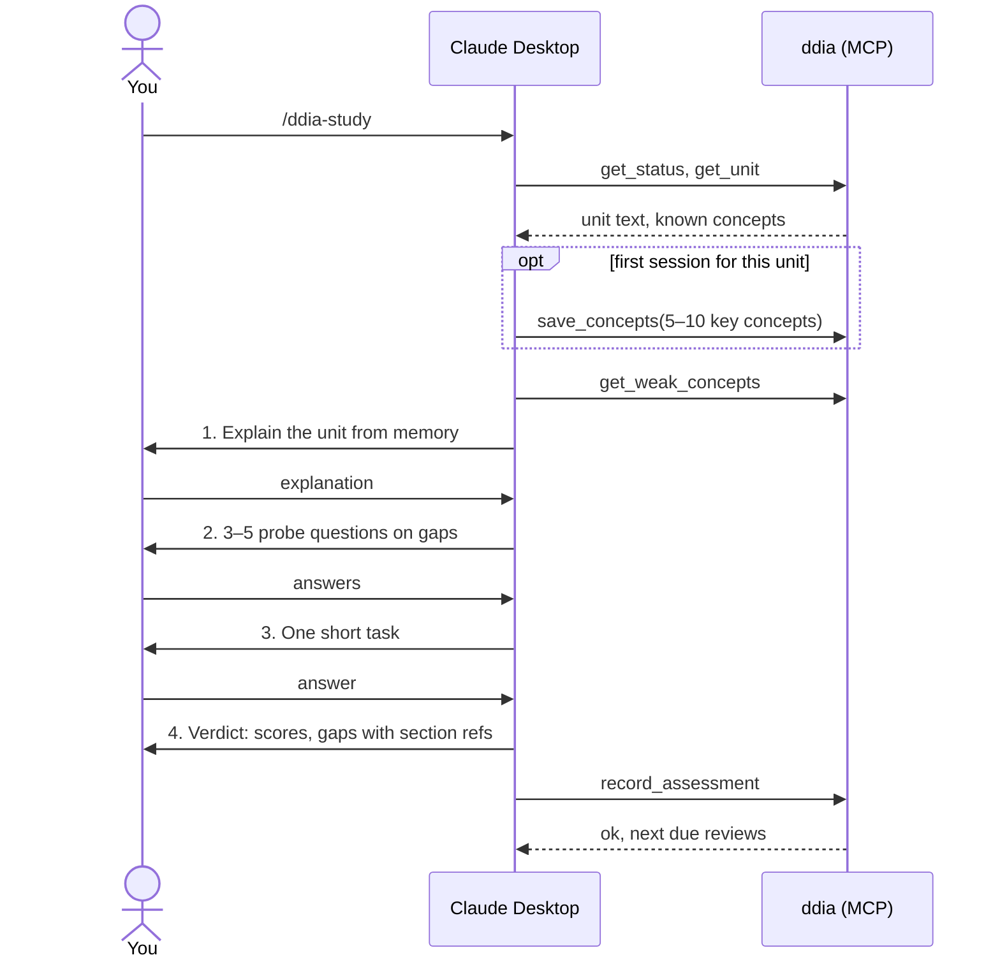

# 04 Study session

A study session covers one unit and runs entirely in Claude Desktop, started from the
`ddia-study` prompt. The service supplies text and stores results. Claude does the teaching.

## Steps

- **SES-1 Explain.** Claude asks for an explanation of the whole unit in your own words, from
  memory, without looking at the book. Claude MUST NOT show the unit text or a summary first.
  The ask MUST say how much is expected: roughly one paragraph per main idea, about 150–300
  words in total, covering what each idea is for and the trade-off behind it rather than
  definitions. More is never penalised; the size is a guide, not a limit.
- **SES-2 Probe.** 3–5 questions aimed at what the explanation missed, got wrong or left vague.
  They focus on *why* and on trade-offs ("what breaks if…", "why not just…"), not on definitions.
  One question at a time, each with short feedback.
- **SES-3 Apply.** Exactly one task (see below).
- **SES-4 Verdict.** A short wrap-up: what's solid, what's shaky, and each gap with the section
  to reread. Then `record_assessment`.
- **SES-5** Claude MUST NOT reveal answers before you've answered. If you say "I don't know",
  that counts as an answer and scores 0.

## Tasks

Tasks are short, scoped and aimed at one specific piece of reasoning.

- **SES-6 Scope.** A task may only rely on material in read scope. That's enforced by MCP-1:
  Claude can't see anything else. Tasks SHOULD mainly test the current unit and MAY pull in
  one earlier concept, preferably a weak one.
- **SES-7 Size.** About five minutes to answer, in a paragraph or a short list. No open-ended "design a system" tasks.
- **SES-8 Shapes.** Each task uses one of the following:

| Shape | Form | Example |
|---|---|---|
| `predict_outcome` | A concrete setup; what happens? | "n=3, w=2, r=2, two concurrent writes to the same key. What can a reader see?" |
| `spot_the_flaw` | A short design or timeline with exactly one flaw | "This leader failover sequence loses writes. Where and why?" |
| `choose_and_justify` | Two options, one constraint; pick and say what breaks | "Log-based vs trigger-based replication for a cross-DB migration. Pick one." |
| `explain_failure` | A production symptom; which mechanism explains it? | "Users see their own comment vanish after refresh. Why?" |

- **SES-9** Claude picks the shape that best fits the unit and, if possible, uses a weak concept.
  It SHOULD NOT use the same shape as in the previous session.

## Scoring

| Score | Meaning |
|---|---|
| 0 | Missing: not mentioned, or wrong |
| 1 | Shaky: the term is known but the mechanism or trade-off isn't |
| 2 | Solid: explains the mechanism correctly |
| 3 | Could teach it: explains why it exists, the trade-offs and the edge cases |

- **SES-10** Every concept in the unit gets a score in each study session.
- **SES-13 Scoring rules.** The score is about the mechanism, not completeness:
  - An answer that names the right mechanism and applies it correctly is at least 2, even if it
    misses a secondary failure mode or an edge case. Those misses cost the 3, never the 2.
  - 1 is for knowing the term or sensing the problem without being able to say how it works.
  - 0 is for wrong, "I don't know", or not mentioned anywhere in the session.
  - A concept's score is the best evidence from the whole session (explanation, probes, task),
    not an average. Probe and task scores use the same scale and the same rules.
  - Concepts are mechanisms, trade-offs and named techniques. Roles, history and products named
    only as examples are not concepts and MUST NOT be scored.
- **SES-11** You can override any score in the web UI. The override wins (DAT-2).
- **SES-12** The unit becomes `studied` after `record_assessment`, whatever the scores are.
  Progress never blocks; weak concepts go to the review queue instead ([05](05-review-queue.md)).
