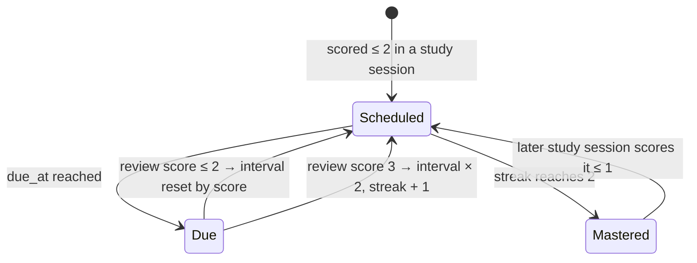

# 05 Review queue

Spaced review works on concepts rather than units: a weak concept comes back on its own,
mixed in with others from across the chapters you've read.

- **REV-1** A concept enters the queue when it scores 0–2 in a study session. Concepts scoring 3 don't enter it.
- **REV-2** The first interval depends on the score: 0 → 1 day, 1 → 2 days, 2 → 7 days.
- **REV-3** In a review, a score of 3 doubles the interval (capped at 60 days) and adds one to the
  streak. A score of 0–2 resets the interval per REV-2 and sets the streak to 0.
- **REV-4** A concept with streak 2 counts as mastered and leaves the queue. It comes back if a later session scores it ≤ 1.
- **REV-5** The `ddia-review` prompt fetches due items (`get_due_reviews`) and asks one short
  question per concept. The question MUST differ from the last one recorded for that concept,
  and SHOULD use one of the SES-8 task shapes. Each answer is recorded with `record_review`.
- **REV-6** Review questions follow the read-scope rule (MCP-1) like everything else.
- **REV-7** Score overrides in the UI (SES-11) also reschedule the item.
