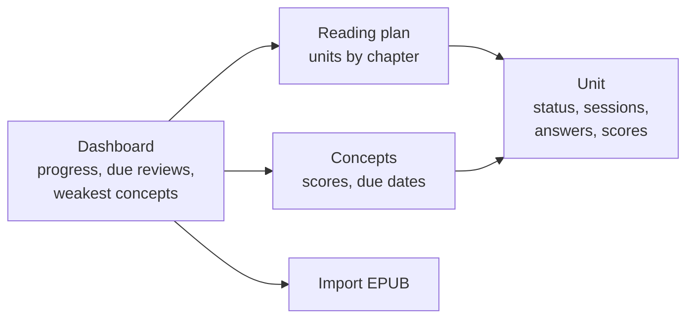

# 06 Web UI

Server-rendered Go templates with htmx for small interactions. There's no SPA build step.
The UI is a tracker: it never shows book text beyond headings.

- **UI-1 Import.** Upload an EPUB, see a parse summary (chapters, sections, figures, word counts,
  proposed units), confirm.
- **UI-2 Reading plan.** Units grouped by chapter, showing word count, approximate page count, status
  and the latest average score. Units can be merged, split at a heading or renamed (ING-11, ING-12).
- **UI-3 Mark read.** One button per unit. After it's clicked, the page shows a hint: "Open Claude
  Desktop and run /ddia-study".
- **UI-4 Unit page.** Section headings (headings only), and every session with its questions, your
  verbatim answers, feedback, scores and gaps. Each gap links to its section ID. Scores can be overridden inline.
- **UI-5 Concepts page.** All concepts in read scope with current score, review due date and streak. Sortable, with the weakest first by default.
- **UI-6 Dashboard.** Units read and studied per chapter, the number of due reviews, and the five weakest concepts.
- **UI-7** The UI MUST NOT render section Markdown. You read in your own reader.
