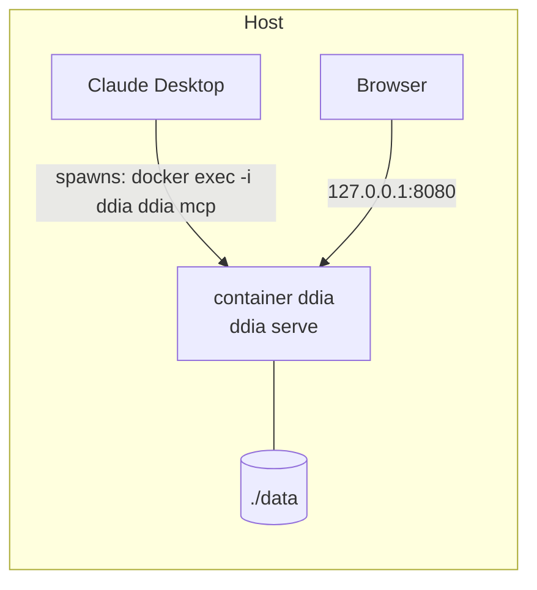

# 07 Deployment



- **DEP-1** The service ships as one Docker image: a static Go binary on a distroless base, with SQLite built
  in through a cgo-free driver (FTS5 included).
- **DEP-2** `docker compose up -d` MUST be enough to start it. The port is bound to `127.0.0.1` only, and data lives in a host volume:

```yaml
services:
  ddia:
    image: ghcr.io/paulnopaul/ddia-assist:latest
    container_name: ddia
    command: ["serve"]
    ports: ["127.0.0.1:8080:8080"]
    volumes: ["./data:/data"]
    restart: unless-stopped
```

- **DEP-3** Claude Desktop connects through a stdio bridge into the running container. There's nothing to install on the host:

```json
{
  "mcpServers": {
    "ddia": {
      "command": "docker",
      "args": ["exec", "-i", "ddia", "/ddia", "mcp"]
    }
  }
}
```

- **DEP-4** `/mcp` (streamable HTTP) is also served for clients that can reach localhost
  directly, such as Claude Code. If Claude Desktop gains localhost HTTP support, it can switch to the URL with no other changes.
- **DEP-5** There's no authentication, because of DEP-2's localhost binding. The book text only leaves the
  machine inside your own Claude conversations.
- **DEP-6** CI builds and tests on every PR and publishes the image to GHCR from `main`.
