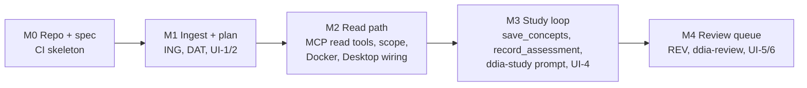

# 08 Roadmap

Each milestone ends with something usable. After M2 you can already study with Claude using the book's
text. M3 adds the write-back.

## Stack (confirmed in M0)

| Concern | Choice |
|---|---|
| Language | Go 1.26 |
| SQLite | `modernc.org/sqlite` v1.60 (cgo-free; FTS5 checked by a test) |
| MCP | Official Go SDK, `github.com/modelcontextprotocol/go-sdk` v1.8 |
| EPUB | `archive/zip` + `encoding/xml`, and `golang.org/x/net/html` for XHTML |
| HTML → Markdown | `github.com/JohannesKaufmann/html-to-markdown` |
| UI | `html/template` + htmx |

## Open questions

1. **Figures in sessions.** Sending images costs context. The default is captions only, with Claude calling `get_figure` when a question depends on a diagram.
2. **Claude Desktop and localhost HTTP.** DEP-3 assumes Desktop can't reach a localhost MCP URL. Verify this in M2 and drop the bridge if it can.
3. **Concept quality.** Concepts are extracted by Claude on first study (`save_concepts`). If they turn out uneven, add a way to edit them in the UI.
